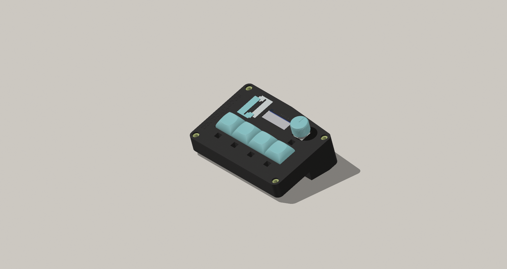
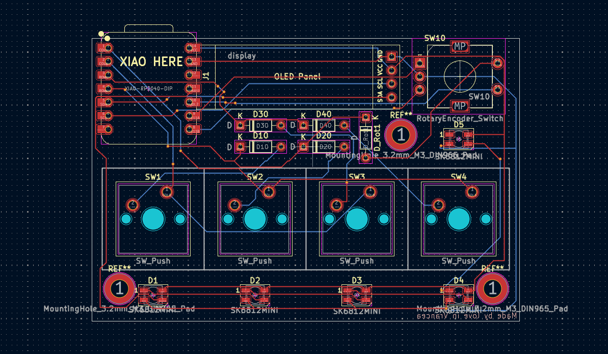
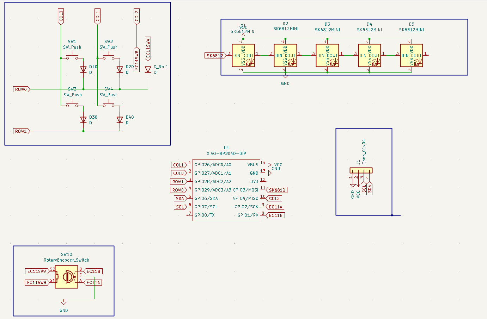

# Socotitoare
The new, refined, 4-button keypad with a rotary encoder that is the best for everything. The project was harder than I thought. I finished after 3 weeks of work, and I thought it would take me like 2 days... Maybe if I hadn't switched between so many CAD tools. KiCAD is the best program to use btw, very intuitive, very good, very nice, Romanian approved. :like:

# Why?
To be honest, I like free stuff. I wanted to design my own things but I didn't have the motivation to start anything because I didn't know anything related. (secret project incoming). When I saw the "Blueprint" idea, I believed that was my moment, and here we are.

# How to use
Plug in a usb type C cable. The keys and knob will be programable through [Input Remapper](https://github.com/sezanzeb/input-remapper).

# BOM

| Part | Quantity | Link |
| :--- | :--- | :--- |
| Cherry MX Switch | 4 | [Link](https://www.aliexpress.com/item/1005006255961111.html) |
| Rotary Encoder (EC11) | 1 | [Link](https://www.aliexpress.com/item/1005010054024165.html) |
| Keycaps | 4 | [Link](https://www.aliexpress.com/item/32842379355.html) |
| OLED Display (SSD1306) | 1 | [Link](https://www.aliexpress.com/item/1005006365845676.html) |
| Microcontroller (XIAO RP2040) | 1 | [Link](https://www.aliexpress.com/item/1005003682505451.html) |
| Diodes (1N4148) | 5 | [Link](https://www.aliexpress.com/item/1005004962400215.html) |
| Leds (SK6812MINI) | 5 | [Link](https://www.aliexpress.com/item/1005001971806517.html) |